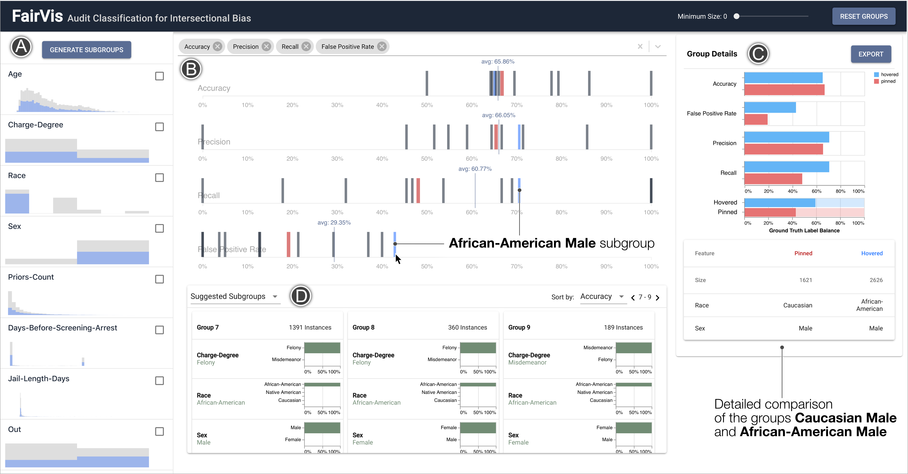

# FairVis: Visual Analytics for Discovering Intersectional Bias in Machine Learning

**FairVis** is a visual analytics system that allows users to audit their classification models for intersectional bias. Users can generate subgroups of their data and investigate if a model is underperforming for certain populations.

* Try a **[live demo](https://poloclub.github.io/FairVis/)**!
* Read the **[full paper](https://arxiv.org/abs/1904.05419)**.
* **[Cite this work and more](https://cabreraalex.com/#/paper/fairvis)**.

**[FairVis: Visual Analytics for Discovering Intersectional Bias in Machine Learning](https://cabreraalex.com/#/paper/fairvis)**  
Ángel Alexander Cabrera, Will Epperson, Fred Hohman, Minsuk Kahng, Jamie Morgenstern, Duen Horng (Polo) Chau
*IEEE Conference on Visual Analytics Science and Technology (VAST). 2019.* 



In this example we show how __FairVis__ can be used on the COMPAS dataset to find significant disparities in false positive rates between African American and Caucasian defendants that are not supported by base rates. The primary components of the system are the following:

__A.__ View distributions of the dataset's features and generate subgroups.

__B.__ Visualize subgroup performance in relation to selected metrics.

__C.__ Compare selected subgroups and view details.

__D.__ Find suggested underperforming subgroups and similar groups.

For more details about the system and its use cases, see the IEEE VAST paper [here][paper].

## Installation

Clone the repository:

```
git clone https://github.com/poloclub/FairVis.git
```

Then initialize the React project by running

```
npm install
```

## Usage

Run the server with

```
npm start
```

## Adding a new dataset

1. Run a model on your data and and create a new file with the last two columns being the output class (between 0-1) of the model and the ground truth labels (0 or 1). Note that only binary classification is currently supported. Examples of models in Jupyter Notebook format can be found in `./models`.

2. Run the `preprocess.py` script on your classified data, e.g. `python3 preprocess.py my-data-with-classes.csv`. Additional options for the helper function can be found using `python3 preprocess.py -h`.

3. Save the processed file to `./src/data/`.

4. Import the file in the `src/components/Welcome.js` component.

5. Add a new row to the table in `Welcome.js` around line `140` in the form of the other datsets.

## Researchers

|  Name                 | Affiliation                     |
|-----------------------|---------------------------------|
| [Ángel Alexander Cabrera][angel]           | Georgia Tech |
| [Will Epperson][will] | Georgia Tech |
| [Fred Hohman][fred]    | Georgia Tech |
| [Minsuk Kahng][minsuk] | Georgia Tech |
| [Jamie Morgenstern][jamie]        | Georgia Tech |
| [Duen Horng (Polo) Chau][polo]             | Georgia Tech |

## Citation
```
@article{cabrera2019fairvis,
  title={FairVis: Visual Analytics for Discovering Intersectional Bias in Machine Learning},
  author={Cabrera, {'A}ngel Alexander and Epperson, Will and Hohman, Fred and Kahng, Minsuk and Morgenstern, Jamie and Chau, Duen Horng},
  journal={IEEE Conference on Visual Analytics Science and Technology (VAST)},
  year={2019},
  publisher={IEEE}
  url={https://cabreraalex.com/#/paper/fairvis}
}
```

## License

MIT License. See [`LICENSE.md`](LICENSE.md).

[paper]: https://arxiv.org/abs/1904.05419 "paper"
[fred]: http://fredhohman.com "Fred Hohman"
[angel]: http://cabreraalex.com/ "Alex Cabrera"
[minsuk]: http://minsuk.com/ "Minsuk Kahng"
[will]: http://willepperson.com/ "Will Epperson"
[jamie]: http://jamiemorgenstern.com/ "Jamie Morgenstern"
[polo]: http://www.cc.gatech.edu/~dchau/ "Polo Chau"
[poloclub]: https://poloclub.github.io
